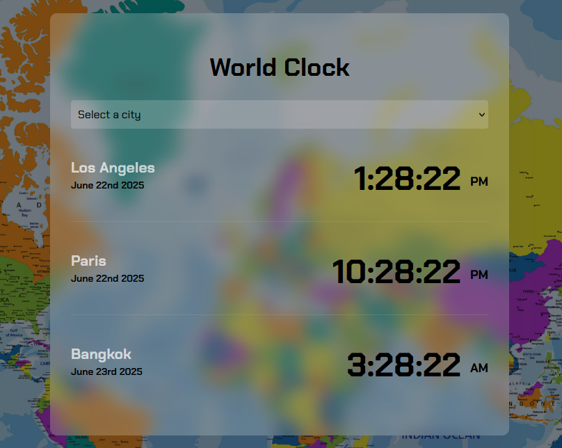

## 📍 Simple World Clock

  👉🏽 Responsive web application that displays the current date and time of a selected city. It features a selector allowing users to choose a city and view its current date and time.   
  💡 Built with HTML, CSS, JavaScript and moment.js. 👉🏽 The website is hosted on <a href="https://simple-world-clock.netlify.app/">Netlify</a>

### World Clock 🕒

